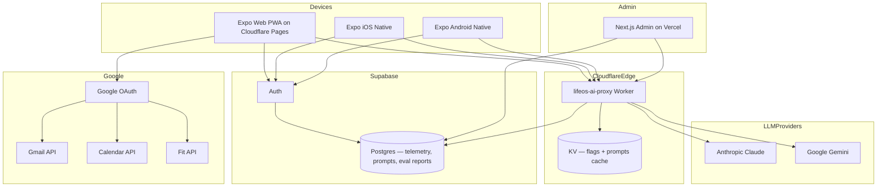
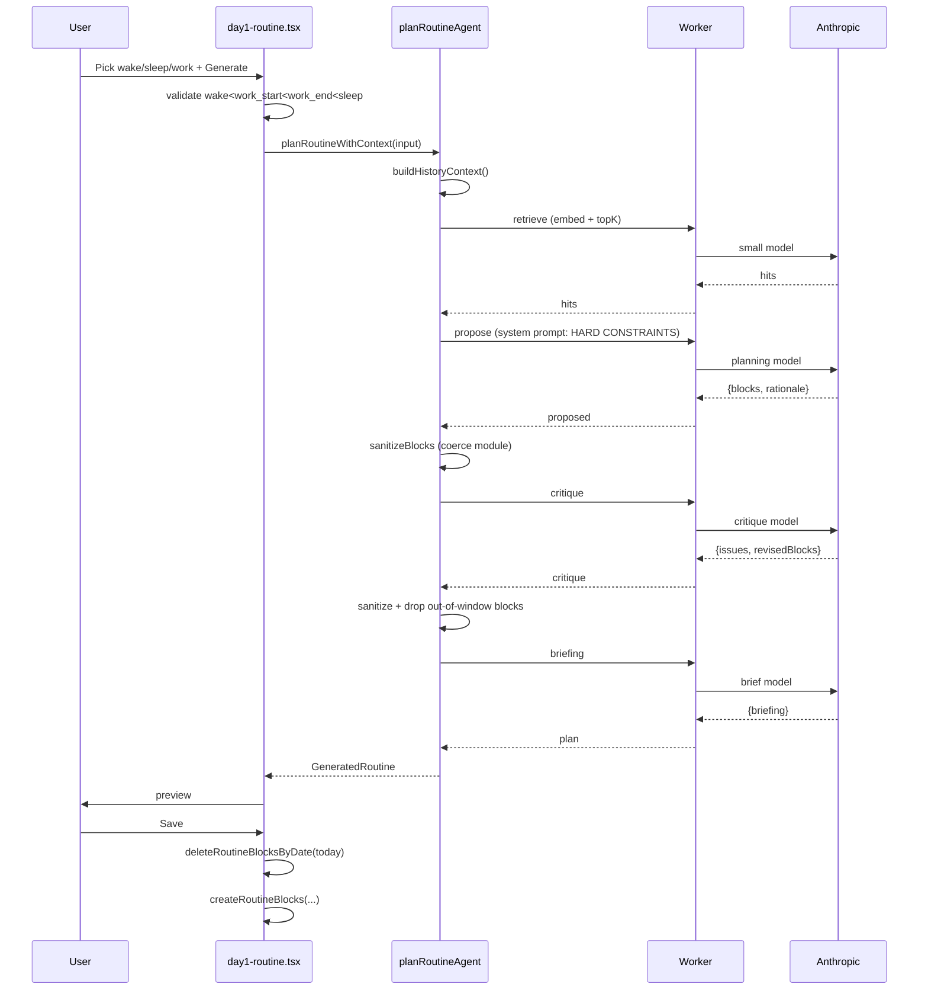
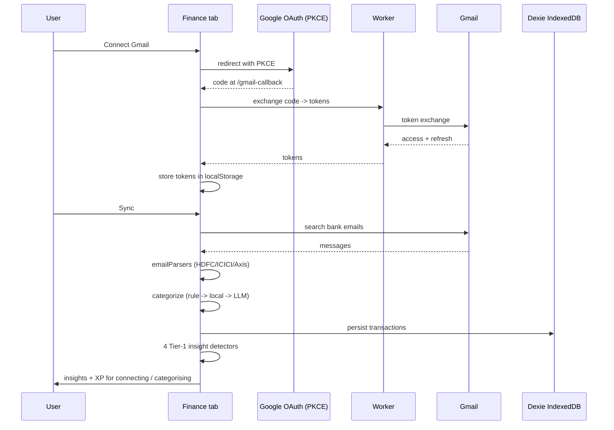
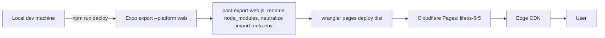

# Architecture

## System Context

## Module Map

| Layer | Module | Purpose |
|---|---|---|
| App shell | `app/_layout.tsx` | Root layout, auth + onboarding routing guard, splash control |
| App shell | `app/(auth)/` | Welcome / Sign-in / Sign-up |
| App shell | `app/(onboarding)/` | day1-* legacy + discovery-* v2 |
| App shell | `app/(tabs)/` | 5-tab nav: Today · Life hub · Health · Finance · Profile |
| App shell | `app/edit-priorities.tsx` | Domain priority editor |
| App shell | `app/what-lifeos-knows.tsx` | Profile slot viewer / editor |
| App shell | `app/data-residency.tsx` | Privacy + data export/delete + telemetry toggle |
| App shell | `app/{gmail,calendar,fit,google-auth}-callback.tsx` | OAuth handshake completion |
| AI | `src/ai/client.ts` | Worker-routed `callAI(request)` |
| AI | `src/ai/modelRouter.ts` | Per-task model selection |
| AI | `src/ai/extractJson.ts` | Robust JSON extraction from LLM output |
| AI | `src/ai/costLedger.ts` | In-memory cost accumulator |
| AI | `src/ai/tracing.ts` | Span helpers for agent steps |
| AI | `src/ai/agent/planner.ts` | propose → critique → commit agent |
| AI | `src/ai/rag/` | Embeddings + retrieval (`indexItems`, `retrieveTopK`) |
| AI | `src/ai/prompts/*.ts` | System prompts per module |
| AI | `src/ai/mocks/*.ts` | Mock responses for `USE_AI_MOCK=true` |
| AI | `src/ai/routineFromProfile.ts` | UserProfile → RoutineInput → blocks |
| AI | `src/ai/replanApply.ts` | `rebalanceRestOfToday`, `generateAndSaveTomorrow` |
| AI | `src/ai/voiceClient.ts` | WebSocket client for voice |
| AI | `src/ai/historyContext.ts`, `profileContext.ts`, `profileLearning.ts`, `profileMerge.ts` | Behaviour synthesis |
| Persistence | `src/db/schema.ts` | Drizzle schema (~20 tables) |
| Persistence | `src/db/index.ts` | Native SQLite init + raw `CREATE TABLE` + indexes |
| Persistence | `src/db/index.web.ts` | Web fallback proxy |
| Persistence | `src/db/webStorage.ts` | Barrel re-export over `src/db/webStorage/<entity>.ts` |
| Persistence | `src/db/webStorage/_io.ts` | Shared `load()` / `save()` helpers |
| Persistence | `src/db/webStorage/_keys.ts` | Every `lifeos_*` localStorage key in one place |
| Persistence | `src/db/webStorage/{users,userProfile,routine,gamification,reflections,discovery,chat,goals,health,finance,polymath}.ts` | One module per entity (or pair of related entities) — interface + CRUD |
| Persistence | `src/db/queries/*.ts` | Per-entity query files (users, goals, routine, health, finance, gamification, …) |
| State | `src/store/useUserStore.ts` | Identity + onboardingStage + primaryDomains |
| State | `src/store/useGameStore.ts` | XP, levels, streaks, badges, quests |
| State | `src/store/useDomainHistoryStore.ts` | 7-day rolling per-domain scores |
| State | `src/store/usePreferencesStore.ts` | rewards toggle, density |
| State | `src/store/useThemeStore.ts` | light/dark mode |
| State | `src/store/useFlagStore.ts`, `usePromptStore.ts` | Remote-config caches |
| Integrations | `src/integrations/google/oauth.ts` | Shared PKCE driver |
| Integrations | `src/integrations/googleAuth/`, `googleCalendar/`, `googleFit/` | Per-scope bindings |
| Integrations | `src/integrations/supabase/` | Client + session token getter |
| Finance | `src/finance/gmail/` | OAuth + fetcher |
| Finance | `src/finance/parsers/emailParsers.ts` | HDFC / ICICI / Axis parsers |
| Finance | `src/finance/categorizer.ts`, `merchantClassifier.ts` | Rule + LLM + local-distilled tiers |
| Finance | `src/finance/db/transactionDb.ts` | Dexie-backed IndexedDB store on web |
| Finance | `src/finance/insights.ts` | 4 Tier-1 detectors |
| Design system | `src/theme/` | colours, typography, spacing, motion, elevation, radii, surfaces, density |
| Design system | `src/components/ui/` | Button, Card, Input, GlassCard, AuroraGlow, etc. |
| App shell | `src/components/shared/ErrorBoundary.tsx` | Class component wrapping root `<Stack>`; emits `EVENTS.uiCrash` |
| Telemetry | `src/utils/telemetry.ts` | `track()` + typed `EVENTS` const map; worker allowlist must mirror these keys |
| Gamification UI | `src/components/gamification/` | HexRadar, LevelRing, AvatarRing, XpBar, StreakFlame, etc. |
| Worker | `workers/ai-proxy/src/` | Hono routes, auth, rate limit, Claude + Gemini routes |
| Worker | `workers/ai-proxy/src/routes/admin/*` | flags, prompts, telemetry, push, feedback, evals |
| Admin portal | `admin/app/(authed)/` | Next.js routes for each admin surface |
| Evals | `evals/cases/*.ts` | 10 case suites |
| Evals | `evals/grader.ts`, `eval.test.ts` | Test harness |
| Scripts | `scripts/post-export-web.js` | node_modules rename + import.meta neutralise |
| Scripts | `scripts/build-food-db.js`, `build-indb.js` | Bundle IFCT + INDB foods |

## Routine Generation — Sequence

## Data Flow — Finance Gmail Ingestion

## Persistence Strategy

| Domain | Native | Web | Rationale |
|---|---|---|---|
| Users (profile + sleep schedule + flags) | SQLite via Drizzle | localStorage `lifeos_users` | Sensitive, fast reads at boot |
| Goals + Tasks | SQLite | localStorage | Cross-screen, cheap reads |
| Health logs (weight, sleep, food, blood) | SQLite | localStorage | Sensitive — never leaves device |
| Routine blocks | SQLite | localStorage | Today screen reads each focus |
| Gamification (scores, XP, badges) | SQLite | localStorage | Fast Today + Rewards reads |
| Domain history (7-day window) | Zustand persist | Zustand persist | Light state, no SQL needed |
| Quests | Zustand + localStorage | Zustand + localStorage | Memory-first, persisted for reload |
| Transactions | SQLite | Dexie IndexedDB | Volume — IndexedDB scales better than localStorage |
| UserProfile (AI-extracted) | SQLite | localStorage | Single JSON blob per user |
| Tokens (Gmail/Calendar/Fit) | localStorage (Expo SecureStore TBD) | localStorage | Web-only today |

## API Surface — Worker

| Path | Purpose | Auth |
|---|---|---|
| `POST /claude` | Anthropic proxy | Supabase JWT |
| `POST /gemini` | Gemini proxy | Supabase JWT |
| `POST /v1/google/token` | Exchange OAuth code or refresh token | Supabase JWT |
| `GET /v1/config` | Public bundle of flags + prompts | Public |
| `POST /v1/telemetry` | Event ingestion | Anonymous (device id) |
| `POST /v1/feedback` | In-app feedback | Supabase JWT |
| `POST /v1/push/register` | Register Expo push token | Supabase JWT |
| `POST /v1/evals/report` | CI eval report ingest | Service key |
| `GET /v1/prompts` | Public prompt fetch | Public |
| `*/admin/*` | Admin routes | Admin role (Supabase) |

## Infrastructure Assumptions

- Cloudflare Pages serves the web bundle (`dist/`). Manual `wrangler pages deploy` from a dev machine — **no CI deploy**.
- Cloudflare Worker `lifeos-ai-proxy` deployed via `wrangler deploy` from `workers/ai-proxy/`.
- Supabase: free tier today. Postgres holds `admin_*`, `telemetry`, `prompts`, `evals`. Auth handles email + Google.
- Vercel: hosts the admin portal. Production branch deploy on push to `lifeosv1`.
- Expo: no EAS build pipeline live yet. Native is dev-only.

## External Dependencies

| Service | Used For | Plan / Limits |
|---|---|---|
| Cloudflare Pages | Web app | Free |
| Cloudflare Workers | AI proxy + admin routes | Free 100k req/day |
| Cloudflare KV | Hot config (flags, prompts) | Free 100k reads |
| Supabase | Auth + Postgres | Free (500 MB) |
| Anthropic API | Claude calls | Pay-as-you-go via worker |
| Google Gemini | Multi-modal + fast paths | Pay-as-you-go via worker |
| Google OAuth + APIs | Gmail / Calendar / Fit | OAuth scopes claimed |
| Open Food Facts | Barcode lookup | Public free API |
| Vercel | Admin portal | Hobby tier |

## Deployment Flow (Web)

Notes:
- `.env` is **gitignored** — every `EXPO_PUBLIC_*` variable must be present on the deploying machine or the bundle inlines empty strings.
- Hard refresh is required after deploy because Pages may cache assets at the edge.
