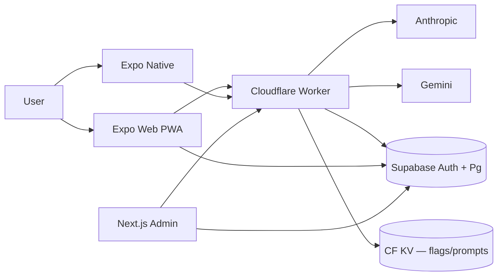

# LifeOS — Master Project Document

## Project Snapshot

| Field | Value |
|---|---|
| Name | LifeOS |
| Tagline | A Digital Life Architect for iOS, Android, and Web |
| Tech | Expo + React Native + Expo Router + TypeScript (strict) |
| Persistence | SQLite (Drizzle ORM) on native; `localStorage` on web |
| Auth | Supabase (email/password + Google OAuth) |
| Backend | Cloudflare Worker `lifeos-ai-proxy` (Anthropic + Gemini + admin routes) |
| Admin Portal | Next.js 14 App Router at `admin/`, deployed on Vercel |
| Web Distribution | Cloudflare Pages — `https://lifeos-6r5-eqa.pages.dev` |
| Repo | `Ramachandran-U/lifeos`, default branch `lifeosv1` |
| Maturity | Pre-production beta — web ships, admin portal v1 in operation |
| Active Contributors | 1 founder + Claude Code + Codex/GPT-5.5 |
| Status as of 2026-05-14 (end of day) | Architect punch-list sweep complete; ErrorBoundary live; schedule single-source-of-truth; zombie tables dropped; webStorage split per-entity; typed telemetry; planner unit-tested |

## Purpose

LifeOS answers a single question continuously: **"What should I do next to improve my life?"**

The product synthesises six specialised life-domain engines into one master daily planner:

| # | Engine | Module Key |
|---|---|---|
| 1 | Goal Intelligence | `goal` |
| 2 | Health Intelligence | `health` |
| 3 | Financial Goal | `finance` |
| 4 | Career & Upskill | `career` |
| 5 | Social Life Intelligence | `social` |
| 6 | Curiosity & Polymath | `polymath` |
| 0 | **Routine Builder** (master planner) | feeds the Today screen |

## Problem Being Solved

Existing productivity apps optimise single dimensions — todos, fitness logs, budgeting. None synthesise a whole life into one adaptive routine. LifeOS treats the day as the unit of optimisation, with explicit priority over six life domains and AI-generated routines that learn from completed vs skipped behaviour.

## Current Maturity

- **Design system**: stable. Aurora visual language; six domain colours; HexRadar + LevelRing + XpBar + StreakFlame components shipped.
- **Onboarding**: two paths coexist — legacy day1-* screens and v2 "discovery chat" (feature-flagged). Welcome-intent is the default entry.
- **Routine Builder**: agentic (propose → critique → commit) with RAG over recent behaviour. Now honours wake/sleep/work bounds deterministically.
- **Domain engines**: Goal Hub, Health (food + vitals + Google Fit + blood reports), Finance (Gmail-powered transaction ingestion + categoriser), Career (skill gap chart + learning resources), Social (lightweight), Polymath (interests + exploration log).
- **Gamification**: XP, levels, streaks, badges, quests, hex radar. Domain history is rolling 7-day.
- **Admin Portal**: feature flags, prompt registry, telemetry, schema-failure feed, push broadcast, eval pass rates. Phases 1–5 + 4b live.
- **Worker (Cloudflare)**: Claude + Gemini proxy, finance Gmail token bridge, admin routes, rate limit.
- **Evals**: 10/10 green at last run. CI publishes pass rates to admin.

## Velocity Estimate

| Period | Commits | Notes |
|---|---|---|
| Initial scaffold (P1-01 → P1-14) | 14 | Single-author task milestones |
| Feb–Apr 2026 (engine rollout) | ~50 | Multi-feature waves |
| Apr 27–28 2026 | ~12 | Admin portal v1 + 5-tab nav + voice + Supabase auth |
| May 12 2026 | 11 | Admin portal phases 3/4/5, AI agentic+RAG, conversational onboarding v2 |
| May 13 2026 | 14 | Architect punch-list, design-bundle gamification merge, food DB expansion, web bundle hardening |
| May 14 2026 | ~14 | UX bug fixes (priorities editor, wake/sleep validation, WheelTimePicker fix) + architect punch-list sweep (ErrorBoundary, schedule SSOT, planner unit tests, drop zombie tables, Drizzle baseline migration, typed `EVENTS` map + worker allowlist sync, chat profile-context memo, doc reconciliation, smoke nav scroll fix, webStorage 695-line split into 12 per-entity files) |

**Trend**: high-velocity feature-flag-gated rollouts; recent shift toward correctness/UX hardening over new features.

## Overall Engineering Health

| Dimension | Rating | Note |
|---|---|---|
| TypeScript strictness | A | 0 errors since 2026-05-13 |
| Test coverage (unit) | B+ | 335 Jest tests passing; agent planner now covered (5 tests); evals 10/10 |
| Test coverage (e2e) | C+ | Playwright smoke nav fixed; `import.meta` neutraliser working in dist |
| Documentation | A | Master Brief, Product Tech Doc, AI Functions, Architect Review all current |
| CI/CD | B | Cloudflare deploy is manual; eval CI reports to admin |
| Observability | B | Telemetry + worker tracing + admin schema-failure feed |
| Security | B | Supabase RLS, worker rate-limit, anon key public-only |
| Scalability | B+ | SQLite per-device + worker; no shared multi-tenant DB |

## Architecture (One-Line View)

## Top 5 Things a New Engineer Must Know

1. **CLAUDE.md is the source of truth.** Read it at session start. Conventions, tech stack, the "what not to do" list.
2. **`primaryDomains` ordering encodes priority** — first item gets ~40% of non-work blocks; this is how the AI knows what matters most.
3. **Web and native diverge on persistence** — every query has a `Platform.OS === 'web'` branch into `webStorage.ts`, which is now a barrel re-export over `src/db/webStorage/<entity>.ts`. Adding an entity = one new file.
4. **AI calls always go through `src/ai/client.ts`** — never direct fetch to Anthropic. The Worker handles auth + rate limit + provider switching.
5. **The Routine Builder is an agent, not a single-shot call** — propose → critique → commit, with deterministic post-LLM guards (drop blocks outside wake-sleep window, coerce hallucinated module names). Covered by 5 Jest tests.
6. **Telemetry events are typed** — use `track(EVENTS.x, ...)`, never a string literal. The worker's allowlist mirrors the same keys.
7. **A render crash no longer blanks the app** — `ErrorBoundary` in `app/_layout.tsx` shows a fallback and emits `EVENTS.uiCrash`.
8. **Schedule has a single source of truth (user row).** `what-lifeos-knows` and `day1-routine` both write to the user row, and mirror to userProfile.

## Reference Files

| Purpose | Path |
|---|---|
| Conventions + tech stack | `CLAUDE.md` |
| Product narrative | `docs/MASTER_BRIEF.md` |
| Technical reference | `docs/PRODUCT_TECHNICAL_DOC.md` |
| AI surface | `docs/AI_FUNCTIONS.md` |
| Current punch-list | `docs/ARCHITECT_REVIEW_2026-05-13.md` |
| Pre-production checklist | `docs/PRE_PRODUCTION_CHECKLIST.md` |
| Manual ops todos | `docs/MANUAL_OPS_TODO.md` |
